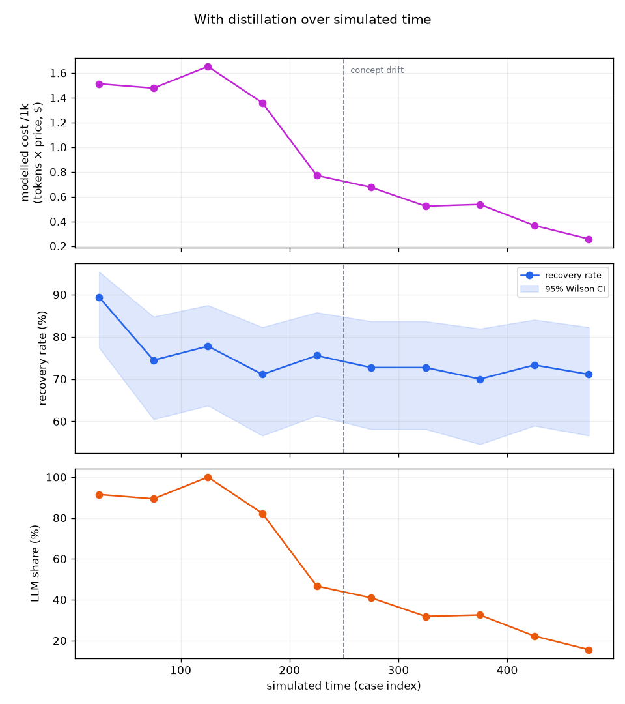
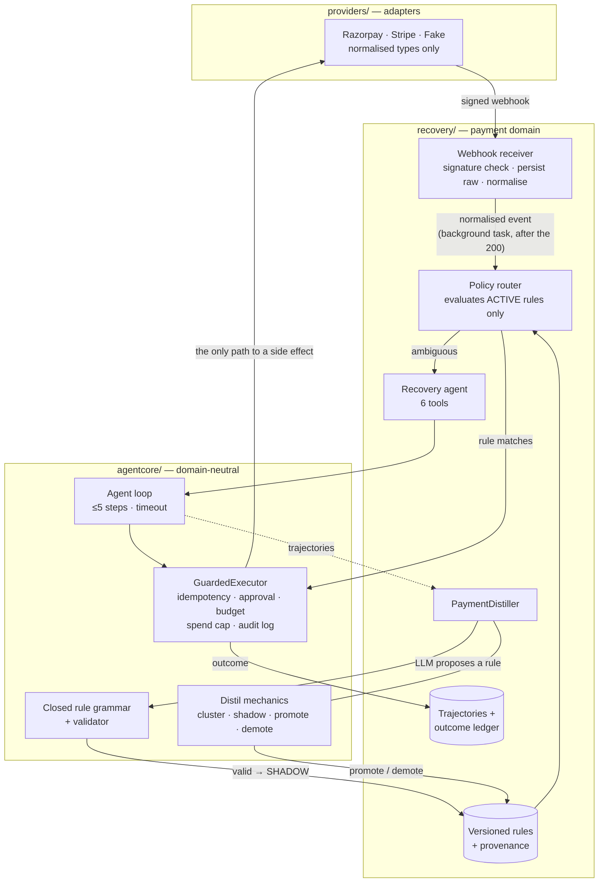

# Self-Distilling Payment Recovery Agent

**An LLM that writes the rules that replace it.**

**The problem.** A recovery agent that asks an LLM about every failed
payment pays — in tokens and latency — to re-derive the same decision over
and over: most failures of a given kind need the same response.

**The idea.** Failed payments are triaged by a deterministic rule router; only ambiguous
cases reach an LLM agent. The agent's successful decisions are clustered, an LLM
proposes a rule for each cluster in a small closed grammar, and each rule must
earn its place in *shadow* before it is promoted. Promoted rules are demoted
automatically when their live recovery degrades. The system stops paying twice
for the same reasoning.

**"Self-distilling" means rules, not weights.** Validated LLM behaviour is
converted into deterministic rules in a closed grammar. No model is
fine-tuned or retrained, and the LLM remains the fallback for every case the
rules do not cover.



*500 synthetic failed payments replayed in time order. Modelled cost and LLM
share fall as rules are promoted; the recovery band holds. Dashed line: concept
drift at case 250.*

> **Read this before the numbers.** Everything below is measured on a
> **synthetic** generator against a **frozen, deliberately weak stub LLM**, with
> **modelled** (not billed) cost. It demonstrates the *mechanism* — rules
> taking traffic off the LLM without losing recovery. It is not evidence about
> real customers, real models, or real money. The eval's main weakness is
> stated plainly in [Why this eval is not circular](#why-this-eval-is-not-circular).

## Run it — one command, no keys

```bash
make install
```

```bash
make demo
```

No API keys, no network, no configuration. `make demo` runs the baseline and the
distilled evaluation on the same 500 cases, writes `evals/results.md`,
`evals/snapshot.json` and `evals/cost_curve.png`, and opens the chart. The
evaluation itself takes a few seconds; installing dependencies dominates.

Without `make` (e.g. on Windows): `pip install -e ".[dev]"` then
`python -m evals.run`. Use `--full` for 2,000 cases.

Other entry points:

```bash
make test
```

```bash
docker build -t payment-recovery . && docker run --rm -p 8000:8000 payment-recovery
```

Or run the app directly, without Docker, from the repository root:

```bash
python -m uvicorn recovery.app:app --host 0.0.0.0 --port 8000
```

Either way the app serves the dashboard on <http://localhost:8000> — cost curve
first, then the outcome ledger, the rule table with status and provenance, and
pending approvals.

### Agent Playground

`/playground` is a visual front end for the live pipeline. You describe a
synthetic failed payment (a `pay_demo_…` id, amount, failure reason). Then
`POST /playground/api/run` puts it in an in-memory **demo** provider, writes a
`demo` internal event and calls the same `RecoveryPipeline.process` the webhook
path uses: PolicyRouter, rule or agent, GuardedExecutor, trajectory, ledger.
The page animates only what the response reports: the path taken, the real
LLM call count, the executor status and audit, the outcome and the ledger row.

- It is a **simulation**. The demo provider has no network and moves no money,
  `amount_recovered_inr` stays null, and every response says so.
- The demo provider is registered on the pipeline, not the webhook router, so
  `/webhooks/demo` does not exist. The webhook path is unchanged.
- Ids must be `pay_demo_…` / `cust_demo_…`. Guard state is keyed on them, so a
  demo run cannot use up a real payment's idempotency keys or a real customer's
  action budget. The client never chooses the action or a refund amount (extra
  fields are rejected), and approval gates apply as usual.
- The endpoint is unauthenticated but rate-limited (20 runs/min per process).
  With `LLM_BACKEND=groq`, each LLM-path run is a real, billed model call.
- The cost/LLM-share figures and the "learned rule" example on the page come
  from `evals/snapshot.json` and are labelled as offline evaluation. The live
  app records trajectories but does not run the distiller itself.
- A "From prototype → live payment recovery" section explains how a Razorpay
  account would trigger the same pipeline through signed webhooks. It is a
  conceptual future path: each step is marked as built, operator setup, or not
  yet run against a real Razorpay test payment. Live mode is not enabled.

## 60-second demo

> 🎬 *Video placeholder — a 60-second walkthrough of `make demo` and the
> dashboard will go here.*

## Live demo

A sandbox deployment runs on Render (free tier, so the first request after a
period of inactivity can take up to a minute while the service wakes):
<https://self-distilling-payment-recovery-agent.onrender.com>

What has been verified **on that deployment** — a live *integration* check,
separate from the synthetic evaluation:

- `/health` answers, and the dashboard renders the frozen evaluation results.
- A Razorpay-style `payment.failed` webhook signed with the configured webhook
  secret is accepted (HTTP 200); the same body with a wrong signature is
  rejected (HTTP 400).
- The accepted event is persisted, normalised (amount in rupees, the shared
  failure-reason enum) and processed by the live pipeline; the result appears
  in the dashboard's *Live application* section.

The test events used synthetic payment ids, not real payments in a Razorpay
test account. The pipeline therefore could not fetch the payment from Razorpay
and recorded each event as `failed`, taking no action — the correct behaviour.
**No payment has been recovered through the deployment, and no real money is
involved: the app accepts only test credentials.**

Demo path, about three minutes:

1. Open the dashboard. **Cost curve** and **Headline** show the synthetic
   evaluation: recovery 74.9% in both arms, LLM share 90.6% → 55.9%, modelled
   cost $1.50 → $0.92 per 1,000 failures.
2. **Rules · evaluation run** shows the distilled rules as `active`, `shadow`
   and `demoted` (card_declined, after the concept drift), with provenance.
3. **Live application** shows what the deployed instance has actually received
   and done. Nothing in it is synthesised.
4. Send a signed test webhook. The helper reads `RAZORPAY_WEBHOOK_SECRET` from
   your environment, which must match the deployment's:

   ```bash
   python scripts/send_razorpay_test_webhook.py --payment-id pay_demo_001 --amount-inr 1000 --error-reason insufficient_funds --url https://self-distilling-payment-recovery-agent.onrender.com/webhooks/razorpay
   ```

   Expect `200`; add `--bad-signature` to see `400`.
5. Reload the dashboard. The event appears under *Received webhooks* and as a
   ledger row; with a synthetic payment id it is recorded as `failed`, with no
   action taken.
6. With a **real failed payment in a Razorpay test account** and test API keys
   configured, the pipeline can fetch the payment, route it (a seed rule or the
   agent) and act through the guarded executor — for example by creating a
   test-mode payment link. That path is described in
   [`docs/RAZORPAY_TEST_MODE.md`](docs/RAZORPAY_TEST_MODE.md) and covered by an
   automated test against a mocked Razorpay API; it has not yet been run with a
   real test payment.

Deployment limitations: a single instance; SQLite on Render's ephemeral
filesystem, so live state resets on every redeploy or restart (the seed rules
are re-inserted at startup); no authentication on the dashboard.

## Architecture

Three layers, enforced by import tests: `agentcore` knows nothing about
payments, `providers` hides every provider-specific string, and `recovery`
wires the payment domain.



## The live application

The FastAPI app runs the same system the evaluation measures, end to end:

```text
signed webhook → verify signature → persist raw → normalise → 200
      ↓  background task, after the response has been sent
provider enrichment → policy router → ACTIVE rule | agent loop
      → GuardedExecutor → provider TEST API → trajectory → outcome ledger
```

- **Acknowledgement never waits on recovery.** The webhook returns 200 once the
  raw and normalised events are stored; routing, the provider calls and any LLM
  call run as a FastAPI background task afterwards. There is no queue
  infrastructure: a failed-payment event with no ledger row is picked up at the
  next startup, so a crash between the 200 and processing loses nothing.
- **One implementation of every guardrail.** The rule path and the agent path
  build their executor from the same function (`build_executor` in
  `recovery/agent.py`), so both act only through `GuardedExecutor`, with the
  same tools and limits as the evaluation. Guard state is persistent
  (`SqlGuardStore`), so idempotency keys, approvals, budgets and spend caps hold
  across requests and restarts.
- **Active rules bypass the LLM; shadow rules never act.** The router evaluates
  only `ACTIVE` rules. A match is carried out by the same tool the agent would
  have used, with no LLM call; anything else goes to the agent.
- **Redelivered webhooks are harmless.** A repeated provider event id is
  recorded and dropped before routing — no second LLM call, no second action.
  A distinct event about the same payment is stopped by the executor's
  persistent idempotency keys.
- **The frozen stub is the default LLM**: no key, no network. `LLM_BACKEND=groq`
  opts into Groq, and the app refuses to boot in that mode without a key.
- **The ledger records what was done, not what it earned.** Whether the
  customer then pays is only known later, so live "amount recovered" stays empty
  rather than being guessed. The dashboard's *Live application* section shows
  this persisted state and nothing else.

`tests/test_live_pipeline.py` drives the real app with signed webhooks for all of
the above. A manual procedure for Razorpay TEST mode is in
[`docs/RAZORPAY_TEST_MODE.md`](docs/RAZORPAY_TEST_MODE.md). Its signed-webhook
step has been run against the Render deployment with a synthetic payment id
(see [Live demo](#live-demo)); the full path with a real Razorpay test
payment has not yet been run.

## Results

Same deterministic run (500 cases, seed 42, drift at case 250) for both columns;
only distillation differs. Every rate carries a 95% Wilson interval.

| Metric | Baseline | With distillation |
| --- | --- | --- |
| Recovery, treated | 74.9% (70.7–78.7) | 74.9% (70.7–78.7) |
| Natural recovery, control group (no action) | 13.2% (6.5–24.8) | 13.2% (6.5–24.8) |
| **Incremental recovery vs control** | **+61.7 pts** | **+61.7 pts** |
| **LLM share of treated traffic** | 90.6% (87.5–93.0) | **55.9% (51.3–60.5)** |
| **Modelled cost / 1,000 failures** | $1.50 | **$0.92** |
| Wrong-tool rate (vs hidden ground truth) | 12.5% (9.8–15.9) | 12.5% (9.8–15.9) |
| Latency p50 / p95 (modelled) | 2,461 / 2,472 ms | 2,454 / 2,472 ms |
| Rules promoted / demoted | — | 3 / 1 |
| Invalid rule proposals rejected | 0 | 0 |
| Guardrail trips | 0 | 0 |

**Held flat — by the predefined criterion, the two recovery intervals overlap.**
They are in fact identical, and that is worth being suspicious of: the promoted
rules agreed with the agent on 100% of shadow observations, so they reproduce
its decisions exactly. Distillation here *copied* a deterministic reasoner; it
did not have to be robust to a noisy one. I report the component intervals; I
did not compute an interval on the incremental *difference* itself (Newcombe's
method would be the right tool).

Headline numbers are **incremental against a 10% no-action control group**,
never raw. Full tables: [`evals/results.md`](evals/results.md).

**What moved, and when** (from `evals/snapshot.json`):

| Rule | Promoted at case | Outcome |
| --- | --- | --- |
| `failure_reason = insufficient_funds` | 175 | active |
| `failure_reason = card_declined` | 225 | **demoted at case 500** after drift at 250 |
| `failure_reason = expired_card` | 425 | active |
| `processing_error`, `authentication_required`, `unknown` | — | still shadow |

Two results are weaker than the chart suggests:

- **LLM share fell to 55.9%, not near zero.** Three candidates were still in
  shadow at the end: lower-frequency reasons need 30 shadow observations and did
  not reach that inside 500 cases.
- **Demotion worked, but slowly — 250 cases after the drift, at the last check
  in the stream.** The detector needs 30 recent firings whose recovery upper
  bound falls below 50%; post-drift recovery under the wrong action sat near
  30%, so it only crossed the line at the end. With a slightly different stream
  it might not have fired within 500 cases. I did not tune it to fire sooner.

## How distillation works

1. **Collect.** Every case the LLM agent handles is recorded as a structured,
   replayable trajectory (thought, tool, arguments, bounded observation,
   decision, tokens, latency).
2. **Cluster.** Handled cases become generic `Situation`s — sorted
   `(feature, value)` pairs supplied by the payment layer: failure reason,
   amount band, failure history, recency, channel. Clusters are formed at the
   reason level first and refined by amount band if a reason is inconsistent.
3. **Propose.** For a cluster with support ≥15, action agreement ≥0.80 and
   recovery ≥0.60, the proposer LLM (`prompts/rule_proposer.v1.md`) is asked for
   one rule. Its output is **untrusted input**.
4. **Validate.** The proposal must parse under the closed grammar or it is
   rejected **wholesale**. A precondition is a conjunction of whitelisted
   predicates `(field, op, typed literal)` over whitelisted fields; an action is
   one member of a fixed action set with typed parameters. Rules are JSON data:
   nothing is `eval`'d, `exec`'d, compiled or templated, and rules are
   re-validated when loaded, so a tampered row never becomes executable.
5. **Shadow.** Candidates start in `SHADOW`. The router only evaluates `ACTIVE`
   rules, so a shadow rule observes live traffic — recording whether it would
   have chosen what the agent chose, and whether that case recovered — but can
   never cause a side effect.
6. **Promote.** Thresholds were fixed from first principles *before* any
   comparison was run ([`agentcore/distill/lifecycle.py`](agentcore/distill/lifecycle.py)):
   - **≥30 shadow observations** — the usual floor for a binomial estimate; it
     caps the 95% half-width at about ±0.18.
   - **Agreement ≥0.90 and its Wilson lower bound ≥0.80** — a rule that replaces
     the LLM must almost always do what the agent did, and not on a lucky
     sample.
   - **Recovery Wilson lower bound ≥0.50** — never cement a mostly-failing
     action. Because agreement is high, this is the outcome-parity check.
7. **Demote.** An active rule is demoted when its **last 30 firings** have a
   recovery Wilson **upper** bound below 0.50 — confidently below the bar that
   justified promotion. The gap between the promotion floor (lower bound ≥0.50)
   and the demotion trigger (upper bound <0.50) is hysteresis against flapping.
   Demotion history is appended, never overwritten.
8. **Never auto-promote a high-value refund.** A rule whose action is a refund
   and whose precondition does not bound the amount strictly below the approval
   threshold stays in shadow forever, whatever its statistics.

Every rule carries provenance: origin, situation key, source trajectory ids,
proposer model and prompt version, creation and promotion times, and its full
demotion history.

## Why this eval is not circular

A sceptic should start here — including with its biggest weakness.

**What keeps it honest**

- **The ground truth is hidden by code, not by convention.** The correct action
  for each case lives only in [`evals/ground_truth.py`](evals/ground_truth.py).
  `test_no_production_module_imports_evals` AST-scans `agentcore`, `providers`,
  `recovery` and `llm` and fails if any of them imports `evals`.
- **The agent sees only observable features** (reason, amount, channel, customer
  history, time since last attempt) through its tools. The mapping from those
  features to the right action is what is hidden.
- **Recovery is decided by a customer simulator, not by a successful tool
  call.** Each synthetic payment has a hidden persona (price sensitivity,
  patience, channel preference, abandonment threshold); the simulator modulates
  the ground-truth probability by persona and makes a deterministic draw.
- **Label noise.** 8.1% of cases fail even when the statistically correct action
  is taken.
- **Concept drift.** At case 250 the correct action for `card_declined` flips
  from "send a payment link" to "escalate". A rule promoted before the drift
  must degrade afterwards, and one did.
- **A control group.** A deterministic 10% of failures get no action at all, so
  natural recovery (13.2%) is measured, and headline recovery is incremental.
- **Nothing was tuned to the result.** The stub LLM, the simulator, the ground
  truth, the seed and the promotion/demotion thresholds were each written once,
  from stated principles, before the comparison — and frozen. The distiller's
  amount bands (₹2k / ₹10k) deliberately do not match the ground truth's ₹5k
  boundary.

**Where it falls short — the main weakness**

The brief required that the reason code alone be insufficient for roughly a
third of cases, so that memorising reason → action would plateau well short of
ceiling. **This generator does not achieve that.** Measured over 1,000
pre-drift cases, the *best possible* reason-only policy is wrong on only
**1.9%** of them: context changes the right answer for 4.1% of
`insufficient_funds` and 5.9% of `processing_error` cases. The context
dependence exists but barely bites.

Consequences, stated directly:

- Reason-level rules are sufficient for almost all traffic, which is why every
  promoted rule is reason-only and the context-refinement path never fired.
- The wrong-tool rate (12.5%) is mostly the drift, not context, and it does not
  move with distillation: rules replicate the stub, they do not out-think it.
- This eval therefore shows distillation **offloading** a reasoner. It does
  **not** show distillation discovering context-dependent rules.

I did not strengthen the generator after seeing results, because that would
make the comparison circular in a different way. A v2 generator would make
context flip the correct action for a real share of traffic, and fix that
before running anything.

**Other things to keep in mind**

- The "LLM" in every reported number is a frozen, **context-blind stub** (it
  maps failure reason to action and never refunds). The demo proves the
  mechanism, not a model's intelligence. The Groq client exists but has not been
  evaluated against the live API.
- The same author wrote the generator and the system. Hidden-ness is enforced by
  import boundaries, not by independent authorship.
- Everything is synthetic: amounts follow a long-tailed rupee distribution, but
  customers, failure mixes and personas are invented.

## Guardrails

Every side effect goes through `GuardedExecutor`. An effect tool has no
callable of its own — only a builder that produces an `Action` (pure data) — so
there is no code path to a provider that skips the checks below.

| Control | What it guarantees | Proved by |
| --- | --- | --- |
| Single path to side effects | Effect tools carry no handler; effects appear in the executor's audit log | `test_effect_tools_have_no_direct_handler`, `test_side_effect_only_happens_through_the_executor` |
| Idempotency, persisted | A double-fire produces exactly one effect, including across a restart | `test_idempotent_replay_produces_exactly_one_effect`, `test_persisted_idempotency_survives_restart` |
| Approval gate | Cost above the threshold goes to a pending queue and does not execute | `test_above_threshold_enters_pending_and_does_not_execute`, `test_refund_above_threshold_hits_approval_gate` |
| Approval bypass attempts | Repeated calls, self-authorising params, wrong run, rejected approvals — all refused | `test_repeated_execute_never_bypasses_pending`, `test_params_cannot_self_authorise`, `test_approve_from_wrong_run_rejected`, `test_rejected_approval_never_executes` |
| Server-derived refund amount | The model cannot choose or inflate a refund; approval and spend cap see the provider's authoritative amount | `test_model_supplied_refund_amount_is_rejected`, `test_refund_uses_authoritative_amount_not_event_or_model` |
| Per-run spend cap | The breaker trips and halts the whole run | `test_spend_cap_breaker_trips_and_halts_run` |
| Per-subject action budget | Actions for one customer are capped per run | `test_action_budget_exhaustion` |
| Append-only audit log | No update/delete surface; the log replays to the same state | `test_audit_is_append_only`, `test_audit_log_replays_to_store_state` |
| Bounded agent | ≤5 iterations and a timeout; malformed output fails safe with a replayable trajectory | `test_max_iterations_cutoff`, `test_timeout_fails_safely`, `test_malformed_output_fails_safely_and_is_replayable` |
| Tool safety | Invented tools and invalid arguments are rejected, never executed | `test_unknown_tool_rejected_then_run_continues`, `test_invalid_arguments_rejected_then_run_continues` |
| Rule grammar | 23 hostile proposals rejected wholesale; tampered stored rules skipped | `test_hostile_proposal_is_rejected`, `test_tampered_row_is_skipped_on_load` |
| Shadow isolation | A matching shadow rule causes zero provider calls | `test_shadow_rule_produces_no_provider_side_effects` |
| Refund auto-promotion | A high-value refund rule never auto-promotes, even with perfect stats | `test_high_value_refund_rule_never_auto_promotes` |
| Automatic demotion | A degrading rule is demoted with history recorded, and stops executing | `test_degraded_active_rule_auto_demotes_with_history` |
| Webhook boundary | Bad signatures are rejected before anything is persisted; the raw event is persisted before normalisation | `test_bad_signature_rejected_without_processing`, `test_raw_persisted_even_when_normalisation_fails` |
| Live path, same guardrails | In the running app, both the rule path and the agent path act only through the guarded executor; active rules never call the LLM | `test_every_provider_side_effect_goes_through_the_guarded_executor`, `test_active_rule_handles_matching_case_without_the_llm` |
| Duplicate webhook delivery | A redelivered event is recorded but never re-routed or re-executed; a second event for the same payment is stopped by the persistent idempotency key | `test_duplicate_webhook_delivery_executes_once`, `test_distinct_events_for_one_payment_are_idempotent_at_the_executor` |
| Sandbox keys only | The app refuses to boot with live Razorpay or Stripe keys | `test_live_razorpay_key_refused`, `test_live_stripe_key_refused` |
| Layering | `agentcore` imports nothing from the other layers | `test_agentcore_imports_nothing_from_other_layers` |
| Dashboard | Rule text originates from LLM output and is HTML-escaped | `test_untrusted_rule_content_is_escaped` |
| Playground | Demo ids are namespaced, extra fields (action, refund amount) are rejected, results are labelled simulation | `test_input_cannot_leave_the_demo_namespace_or_steer_the_decision`, `test_demo_result_is_labelled_simulation_and_never_a_recovery` |

## What the customer simulator taught us

Sweeping the retry budget over the same treated cases:

| Retry budget | 1 | 2 | 3 | **4** | 5 | 6–8 |
| --- | --- | --- | --- | --- | --- | --- |
| Recovery | 55.3% | 69.4% | 74.9% | **76.5%** | 76.7% | 76.7% |

The empirically optimal budget is **4**: the smallest budget within one
percentage point of the best observed recovery. Going from one attempt to two is
worth 14 points; beyond four, nothing.

**Be careful with this finding.** The plateau is the simulator's own design
showing through: each persona's abandonment threshold is drawn uniformly from 1
to 5, so no budget above 5 can help. What the sweep genuinely demonstrates is
the *method* — find the knee empirically instead of guessing a number. The
value 4 is a property of this simulator, not of real customers.

## Adding a provider

One adapter file plus a conformance harness. Nothing above `providers/`
changes.

1. Implement `PaymentProvider` in `providers/<name>.py`, mapping the provider's
   strings, statuses and minor-unit amounts onto `providers/types.py`, and its
   errors onto `providers/errors.py`.
2. Add a harness to `tests/test_provider_conformance.py`. The same ten contract
   checks then run against your adapter as against Fake, Razorpay and Stripe.
3. Register it in `recovery/providers_registry.py` — a flat mapping, no
   branching.

Stripe was added exactly this way. `tests/test_provider_leakage.py` enforces the
result: `agentcore` never mentions a provider, `recovery` names one only in the
registry, and the same agent, guardrails and trajectory code run against Stripe
unchanged.

Both real adapters call the provider's **REST API over `httpx`**. They are not
SDK integrations, every call in tests is mocked, and neither has been run
against a live account. Stripe needed honest approximations — no
Razorpay-style Order, so "order" is a Checkout Session; payment links are
Checkout Sessions because the Payment Links API needs pre-created Prices. Each
is documented and tested in [`providers/PROVIDERS.md`](providers/PROVIDERS.md).

## Reusing `agentcore` outside payments

`agentcore` provides the loop, guardrails, grammar and distillation mechanics
with no payment code in it. A support-ticket triage domain, for example:

```python
from agentcore.distill import (Observation, PromotionPolicy, ShadowStats,
                               Situation, cluster_observations, qualifies_for_promotion)
from agentcore.guardrails import Action, GuardedExecutor, GuardPolicy, InMemoryGuardStore
from agentcore.rules import ActionSpec, FieldSpec, FieldType, Schema, evaluate, parse_rule

# 1. The domain vocabulary is injected, not built in.
schema = Schema(
    fields={
        "category": FieldSpec(FieldType.ENUM, frozenset({"billing", "bug", "how_to"})),
        "customer_tier": FieldSpec(FieldType.ENUM, frozenset({"free", "pro"})),
    },
    actions={"auto_reply": ActionSpec("auto_reply"), "page_oncall": ActionSpec("page_oncall")},
)

# 2. Distil: cluster what the LLM agent did, per situation.
obs = [Observation(Situation.from_mapping({"category": "how_to", "customer_tier": "free"}),
                   "auto_reply", True, f"t{i}") for i in range(40)]
cluster = cluster_observations(obs, ["category"])[0]   # dominant action: auto_reply

# 3. The LLM proposes a rule; it is data, validated against the closed grammar.
rule = parse_rule({"precondition": {"all": [{"field": "category", "op": "eq", "value": "how_to"}]},
                   "action": {"name": "auto_reply", "params": {}}}, schema)
assert evaluate(rule, {"category": "how_to", "customer_tier": "pro"})

# 4. Promote only on the same principled thresholds.
assert qualifies_for_promotion(ShadowStats(matched=40, agreed=40, recovered=36), PromotionPolicy())

# 5. Side effects still go only through the guarded executor.
executor = GuardedExecutor("run-1", InMemoryGuardStore(),
                           GuardPolicy(approval_threshold=0, per_subject_action_budget=3,
                                       per_run_spend_cap=100))
executor.register("page_oncall", lambda action: {"paged": action.subject_id})
executor.execute(Action("page_oncall", subject_id="ticket-42", idempotency_key="page:42", cost=1))
# -> PENDING_APPROVAL: paging on-call now needs a human.
```

This snippet runs as written. What you would still write for a new domain is
the equivalent of `recovery/distiller.py` (about 370 lines: feature extraction,
the proposer call, and wiring shadow statistics to a rule store) plus your
tools. `agentcore` supplies the mechanics, not a turnkey distiller.
`tests/test_rule_grammar_neutrality.py` proves the grammar against a weather
schema.

## What breaks at 10,000 transactions per minute

About 167 failures a second. In roughly the order they would bite:

1. **Idempotency is replay-safe but not concurrency-safe.** The executor checks
   for a stored result, runs the effect, then records it. Two workers handling
   the same key at once can both pass the check and both refund. The fix is to
   claim the key first — insert an `in_progress` row under a unique constraint
   before calling the provider. **This is the most important item on this list.**
2. **Spend caps and action budgets are read-then-increment** — the same race;
   they need atomic updates (`UPDATE … SET spent = spent + :cost WHERE spent +
   :cost <= :cap`).
3. **Recovery runs in-process, one event at a time.** The webhook returns 200
   and a background task processes the event under a single process-wide lock,
   with a startup drain for anything a crash left behind. That is one worker. At
   this rate it needs a real queue and a worker pool — and SQLite, single-writer
   for webhooks, trajectories, rules, the ledger and the guard store alike, must
   become Postgres with pooling.
4. **The router re-reads and re-validates every active rule on every event**,
   and the distiller re-queries rules per case. Both need an in-memory compiled
   rule set, invalidated when a rule's version or status changes.
5. **LLM latency.** Even after distillation, 55.9% of traffic reaches the LLM:
   about 93 agent runs a second, each taking ~2.5 s (modelled), so roughly 230
   in flight at once. That needs a worker pool, rate limits against the LLM API,
   timeouts, and a circuit breaker that falls back to escalation.
6. **Audit sequence numbers** are `max(seq) + 1` with no unique constraint, so
   concurrent writers can collide.
7. **Trajectory JSON** grows without bound in the primary database and should
   move to cheaper storage.
8. **Webhook replay.** A redelivered event id is caught before routing, but
   Stripe's timestamp tolerance is not enforced and Razorpay signatures carry no
   timestamp, so an old signed body re-sent under a new event id is processed
   (its effects are still stopped by the per-payment idempotency keys).

## What I would not ship to production

- **A single-process live pipeline.** Recovery runs as in-process background
  tasks under one lock, with a startup drain for crash recovery. That is correct
  for one process and no more: it is not a queue, a failed attempt is retried
  only by a redelivery or a restart, and several workers would race (next point).
- **The concurrency races above** (idempotency, spend cap, budgets, audit
  sequence). Fine for a single process; unsafe with several.
- **The LLM customer simulator is a scaffold.** `CachedLLMCustomerSimulator`
  falls back to the deterministic persona simulator; the LLM persona path is not
  implemented. Every recovery number comes from the deterministic simulator.
- **No live model, and no real provider payment, has been exercised.** The
  stub drives every number; the Groq client and the Stripe adapter are tested
  only against mocks. On Razorpay, only the signed-webhook path has run against
  the deployment (with a synthetic payment id); no real test payment has gone
  through the pipeline.
- **Approvals cannot be decided over HTTP.** High-value actions are held
  safely, but there is no authenticated route to approve or reject them, so they
  stay pending.
- **Live outcomes are not reconciled.** The ledger records the action taken, not
  whether the customer then paid; nothing consumes capture events to fill in
  "amount recovered".
- **The eval's context dependence is too weak** to show what the brief asked
  for (see above).
- **Demotion is slow** — 250 cases of lag after the drift.
- **The dashboard, playground and webhook endpoints have no authentication**
  beyond webhook signatures. The dashboard shows ledger data to anyone who can
  reach it, and anyone can add rate-limited `demo` rows through the playground.
- **Refunds are full-refund only**; there is no partial-refund path.
- **Packaging:** the app runs from its source tree. A non-editable install
  would not find `prompts/` or the eval artefacts. The Docker image runs from
  source for this reason.
- **Supply chain:** dependencies are pinned but not hash-locked, and GitHub
  Actions are pinned by major version tag rather than commit SHA.
- **Verification.** Development happened on Python 3.13. GitHub Actions runs
  the full suite on Python 3.11 and builds the Docker image, running the suite
  inside it — see the repository's Actions tab for current status. Render
  builds and serves the runtime image.

## Repository map

| Path | What it is |
| --- | --- |
| `agentcore/` | Domain-neutral: agent loop, tool registry, guardrails, rule grammar, distillation mechanics, eval statistics, trajectory model |
| `providers/` | `PaymentProvider` interface, normalised types, Fake / Razorpay / Stripe adapters, conformance contract |
| `recovery/` | Webhooks, policy router, recovery tools, rule store, distiller, FastAPI app, dashboard, agent playground |
| `llm/` | LLM clients: frozen offline stub, disk cache keyed on prompt hash, Groq |
| `evals/` | Hidden ground truth, generator, customer simulator, control group, harness, results |
| `prompts/` | Versioned prompts with purpose / inputs / output headers, and a changelog |
| `docs/` | Manual Razorpay TEST-mode procedure |
| `scripts/` | Helper that signs and sends a Razorpay-style test webhook |
| `tests/` | 250 tests, all network mocked |

## Configuration

Copy `.env.example` to `.env`. Nothing is required for the offline demo or the
tests. Provider keys, if supplied, must be sandbox keys (`rzp_test_…`,
`sk_test_…`): the app refuses to boot otherwise. `LLM_BACKEND` defaults to the
frozen offline `stub`; `groq` requires `GROQ_API_KEY`. `.env` is ignored by both
git and Docker, and the image contains no secrets.

**Public deployments:** set `FAKE_WEBHOOK_SECRET`, `RAZORPAY_WEBHOOK_SECRET` and
`STRIPE_WEBHOOK_SECRET` to random values. Their defaults are written in the
source, so leaving them unset lets anyone sign a webhook the app will accept.
No real money is at risk either way — only test keys are accepted — but forged
events would pollute the ledger.

SQLite is created in the working directory unless `DATABASE_URL` says
otherwise. On a host with an ephemeral filesystem (for example a Render web
service without a persistent disk), the live ledger, rules and guard state
reset on every restart or redeploy; the seed rules are re-inserted at startup.
